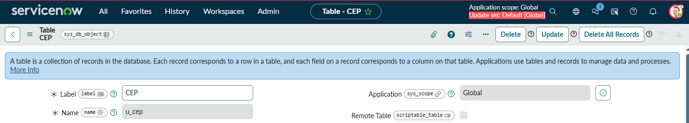
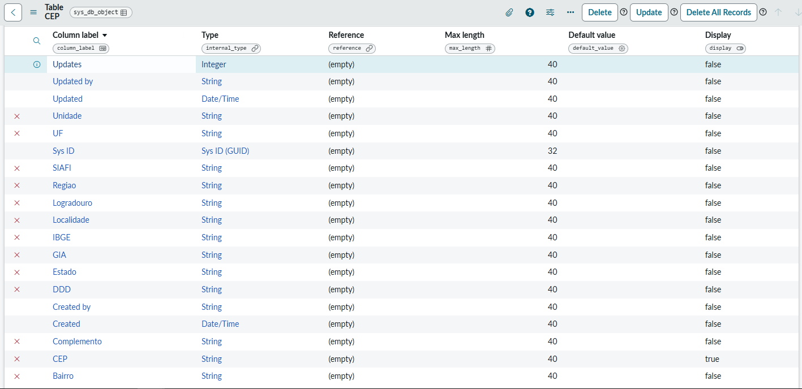
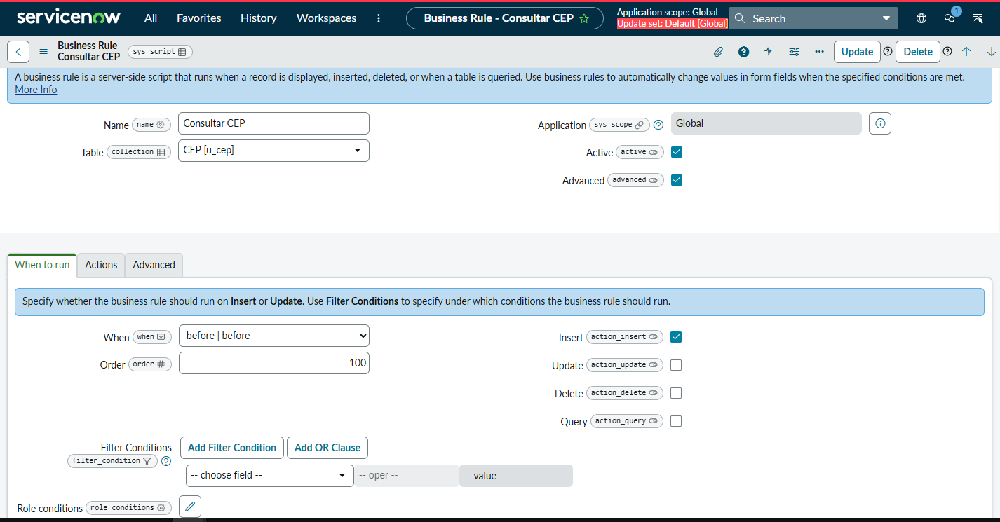
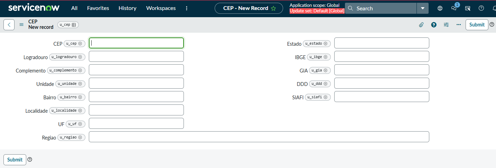
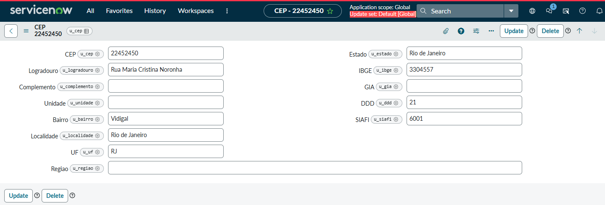

# ServiceNow ViaCEP REST Integration

Projeto desenvolvido em **ServiceNow** com o objetivo de integrar a plataforma à API pública **ViaCEP**, preenchendo automaticamente informações de endereço a partir de um CEP informado pelo usuário.

Este projeto foi desenvolvido como exercício prático para consolidar conhecimentos em integrações REST, Business Rules e manipulação de registros na plataforma ServiceNow.

---

## Objetivo

Automatizar o preenchimento dos dados de endereço utilizando a API do ViaCEP sempre que um novo registro for criado na tabela personalizada **CEP**.

---

## Funcionalidades

- Criação de uma tabela personalizada (`u_cep`);
- Consulta automática à API ViaCEP;
- Consumo de API REST utilizando `RESTMessageV2`;
- Conversão da resposta JSON;
- Preenchimento automático dos campos da tabela;
- Tratamento de CEPs inexistentes.

---

## Tecnologias utilizadas

- ServiceNow
- Server-side JavaScript
- Business Rules
- RESTMessageV2
- JSON
- ViaCEP API

---

## Arquitetura

```
Usuário
    │
    ▼
Tabela CEP
    │
    ▼
Business Rule
    │
    ▼
RESTMessageV2
    │
    ▼
API ViaCEP
    │
    ▼
Resposta JSON
    │
    ▼
Preenchimento automático dos campos
```

---

## Fluxo da aplicação

1. O usuário cria um novo registro na tabela **CEP**.
2. Informa um CEP válido.
3. A Business Rule é executada.
4. A regra realiza uma requisição GET para a API ViaCEP.
5. A resposta JSON é convertida para objeto JavaScript.
6. Os dados retornados são gravados automaticamente no registro.

---

## Estrutura do projeto

```
servicenow-viacep-integration
│
├── README.md
├── docs
│   ├── api-response.json
│   ├── development-notes.md
│   └── screenshots
│
├── scripts
│   └── business-rule.js
│
└── LICENSE
```

---

## Capturas de tela

### Tabela CEP



### Estrutura da tabela



### Business Rule



### Registro antes da execução



### Registro após integração



---

## Exemplo de resposta da API

```json
{
  "cep": "22452-450",
  "logradouro": "Rua Maria Cristina Noronha",
  "complemento": "",
  "bairro": "Vidigal",
  "localidade": "Rio de Janeiro",
  "uf": "RJ",
  "estado": "Rio de Janeiro",
  "regiao": "Sudeste",
  "ibge": "3304557",
  "gia": "",
  "ddd": "21",
  "siafi": "6001"
}
```

---

## Como testar

1. Criar um novo registro na tabela **CEP**.
2. Informar um CEP válido.
3. Salvar o registro.
4. A Business Rule realizará automaticamente a consulta à API ViaCEP.
5. Os campos de endereço serão preenchidos com os dados retornados.

---

## Aprendizados

Durante este projeto foram praticados os seguintes conceitos:

- Criação de tabelas personalizadas no ServiceNow;
- Desenvolvimento de Business Rules;
- Consumo de APIs REST utilizando `RESTMessageV2`;
- Tratamento de respostas JSON;
- Manipulação de registros utilizando Server-side JavaScript;
- Integração entre ServiceNow e serviços externos.

---

## Melhorias futuras

- Validação do formato do CEP antes da consulta;
- Tratamento de timeout e indisponibilidade da API;
- Separação da lógica da integração em um Script Include;
- Implementação de logs para monitoramento das consultas;
- Evitar consultas repetidas para CEPs já cadastrados.

---

## Autor

**João Vitor**

Desenvolvedor em formação com foco em **ServiceNow**, JavaScript e integrações REST.

GitHub: https://github.com/mds-Joao
